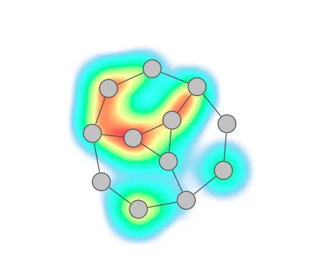

<!--
 //////////////////////////////////////////////////////////////////////////////
 // @license
 // This file is part of yFiles for HTML.
 // Use is subject to license terms.
 //
 // Copyright (c) 2026 by yWorks GmbH, Vor dem Kreuzberg 28,
 // 72070 Tuebingen, Germany. All rights reserved.
 //
 //////////////////////////////////////////////////////////////////////////////
-->
# Heat Map Demo - yFiles for HTML

[You can also run this demo online](https://www.yfiles.com/demos/application-features/heat-map/).

This demo shows how to display a heat map on a graph using the [HeatMapRenderer](https://docs.yworks.com/yfileshtml/api/HeatMapRenderer) class.

The demo simulates heat values for nodes and edges that change randomly over time. In real-world applications, those values would come from actual metrics such as CPU load, network throughput, request latency, error rates, risk scores, or other properties.

## Things to Try

- Use the heat map colors drop down to select different colors for the heat map.
- Use the background drop down to select a background color for the graph component. Some heat gradients look better with a dark background.

See the sources for details.

## Related Demos

[Process Mining Demo](../../showcase/processmining/)
