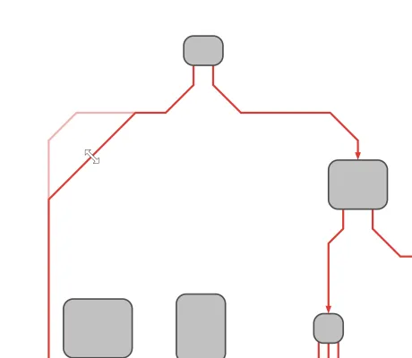

<!--
 //////////////////////////////////////////////////////////////////////////////
 // @license
 // This file is part of yFiles for HTML.
 // Use is subject to license terms.
 //
 // Copyright (c) 2026 by yWorks GmbH, Vor dem Kreuzberg 28,
 // 72070 Tuebingen, Germany. All rights reserved.
 //
 //////////////////////////////////////////////////////////////////////////////
-->
# Octilinear Edge Editing Demo - yFiles for HTML

[You can also run this demo online](https://www.yfiles.com/demos/application-features/octilinear-edges/).

This demo shows how to implement interactive editing of octilinear edges. [OCTILINEAR](https://docs.yworks.com/yfileshtml/api/EdgeRouterRoutingStyle#OCTILINEAR) is a routing style where each edge consists of vertical, horizontal, and diagonal segments. This edge routing style is preserved throughout all interactive editing operations.

The demo combines several techniques:

- A custom edge style that renders bends as octilinear segment cuts.
- Specialized interaction handlers for dragging octilinear segments.
- A layout post-processing stage that prepares the routed edges for the custom edge style.

## Things to Try

- Drag a diagonal segment to adjusts its length.
- Drag a diagonal segment while holding Ctrl to adjust the length of all diagonal segments along the entire edge.
- Drag a diagonal segment while holding Shift to move the segment while keeping neighboring segments orthogonal.
- Select an edge to highlight the center of diagonal segments.
- Click a segment's center to show a handle that allows moving the segment or deleting its corresponding bend.
- Drag the slider in the toolbar to adjust the length of diagonal segments in the entire graph.
- Click the "Apply Layout" button to run a hierarchical layout with an octilinear edge routing style.
- Click the "Apply Router" button to only route edges with an octilinear routing style.

## Demos

- [Orthogonal Edge Editing Demo](../../application-features/orthogonal-edges/)
- [Layout Styles: Edge Router Demo](../../showcase/layoutstyles/index.html?layout=edge-router&sample=edge-router)

## Documentation

- [Orthogonal Edge Editing](https://docs.yworks.com/yfileshtml/dguide/interaction-support#interaction-orthogonal_edge_editing)
