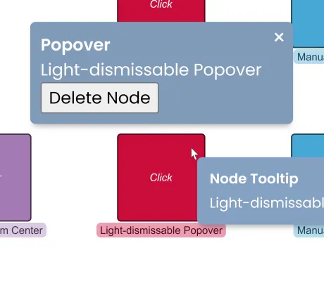

<!--
 //////////////////////////////////////////////////////////////////////////////
 // @license
 // This file is part of yFiles for HTML.
 // Use is subject to license terms.
 //
 // Copyright (c) 2026 by yWorks GmbH, Vor dem Kreuzberg 28,
 // 72070 Tuebingen, Germany. All rights reserved.
 //
 //////////////////////////////////////////////////////////////////////////////
-->
# Tooltips & Popovers Demo - yFiles for HTML

[You can also run this demo online](https://www.yfiles.com/demos/application-features/tooltips/).

This demo shows how to enable tooltips and popovers for graph items, how to customize them using CSS styling, and how to configure different tooltip and popover behaviors.

## Behaviors

Try different tooltip behaviors by hovering or clicking the nodes. There are many configurations possible, this demo shows the following behaviors:

### Default

Tooltips with the default behavior for nodes and edges.

### Above Nodes

Tooltips always appear centered above the node.

### Mouse Attached

Tooltips follow the pointer when moving on the same item.

### Viewport Bottom Center

Tooltips appear centered at the bottom of the viewport.

### Light-dismissable Popover

Clicking a node opens an exclusive, light-dismissable popover while still showing tooltips for other items.

### Manual Popovers

Clicking a node opens a static popover while still showing tooltips for other items. Multiple popovers may be opened at the same time.
