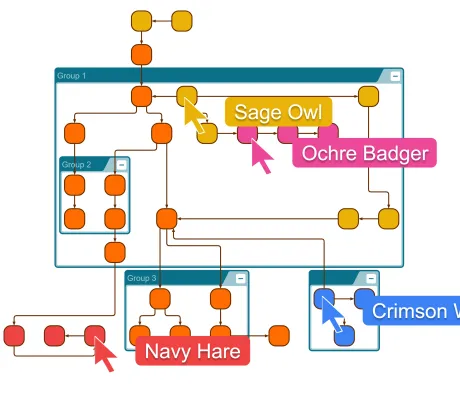

<!--
 //////////////////////////////////////////////////////////////////////////////
 // @license
 // This file is part of yFiles for HTML.
 // Use is subject to license terms.
 //
 // Copyright (c) 2026 by yWorks GmbH, Vor dem Kreuzberg 28,
 // 72070 Tuebingen, Germany. All rights reserved.
 //
 //////////////////////////////////////////////////////////////////////////////
-->
# Collaborative Graph Editing Demo – yFiles for HTML

[You can also run this demo online](https://www.yfiles.com/demos/input/collaborative-graph-editing/).

Demo

This demo builds on yFiles' [Graph Editor Demo](../../view/grapheditor/). See it for a complete guide to the editing gestures and features provided by [GraphEditorInputMode](https://docs.yworks.com/yfileshtml/api/GraphEditorInputMode).

## Try it out

- Open this page in another browser window to join the same room.
- Edit, move, or remove graph items and watch the changes appear in both windows.
- Use the drop-down in the toolbar follow other participants.
- Right click, nodes and edges to change their color, thickness, or shape.
- Use the layout button to apply a layout across all participants.

## How collaboration works

When running locally, run the websocket server in `/collaboration-server` to enable collaboration.

Open this demo in multiple browser windows to edit the same graph together. Every window joins the `collaborative-geim` room through a WebSocket provider.

The shared [Yjs](https://docs.yjs.dev) document is the collaboration model. Changes made in the local yFiles graph are published as shared node and edge records, and changes from other participants are projected back into each local graph.

The collaboration is extended with `nodeStyle` and `edgeStyle` fields. Small serializers convert supported yFiles styles into shared data, while the matching deserializers restore them when records arrive in another window. Additionally, a [HierarchicalLayout](https://docs.yworks.com/yfileshtml/api/HierarchicalLayout) can be applied across all participants to clean up the graph.

Cursor positions, author names, and viewport information are shared temporarily. Other participants' cursors are shown on the canvas, and you can follow another participant's viewport from the presence controls.
