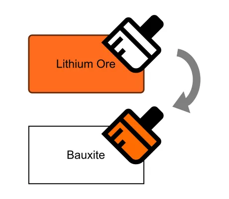

<!--
 //////////////////////////////////////////////////////////////////////////////
 // @license
 // This file is part of yFiles for HTML.
 // Use is subject to license terms.
 //
 // Copyright (c) 2026 by yWorks GmbH, Vor dem Kreuzberg 28,
 // 72070 Tuebingen, Germany. All rights reserved.
 //
 //////////////////////////////////////////////////////////////////////////////
-->
# Custom Copy and Paste Demo - yFiles for HTML

[You can also run this demo online](https://www.yfiles.com/demos/input/custom-copy-and-paste/).

This demo shows how to implement functionality that lets you copy the style of graph items and paste it onto other graph items. The copy operation itself remains unchanged — only the paste operation is customized.

## Things to Try

1.  Select one or more graph items, but no more than one of each type (nodes, edges, node labels, edge labels). For example, select the "Lithium Ore" node and the "refine" edge.
2.  Press Ctrl + C or click the Copy button in the popover or toolbar. The items are copied using the standard [graph clipboard](https://docs.yworks.com/yfileshtml/api/GraphClipboard).
3.  Select any number of graph items — for example, the “Bauxite” node and its “refine” edge — and then press Ctrl + Alt + V or click the Paste button in the popover or in the toolbar. The styles from the copied items are now applied to the corresponding graph items in your current selection.

## Paste Options

- **Style** – When enabled, the style of the copied items is applied to the selection. This includes, among other attributes, fill color, stroke, shape, and font size.
- **Node Size** – When enabled, the size of the copied node is applied to the selected nodes, preserving their center positions.
- **Label Positioning** – When enabled, the label model and its layout parameter are transferred to the selected labels. In the sample graph, you can paste the interior label model of a styled node onto an unstyled node to replace its exterior label model.

## Behavior

- The style of labels is automatically copied and pasted together with their owner without the need to explicitly select them. This behavior can be customized using property [dependentCopyItems](https://docs.yworks.com/yfileshtml/api/GraphClipboard#dependentCopyItems).
- If a label is selected without its owner, this label style will be applied to node and edge labels.
