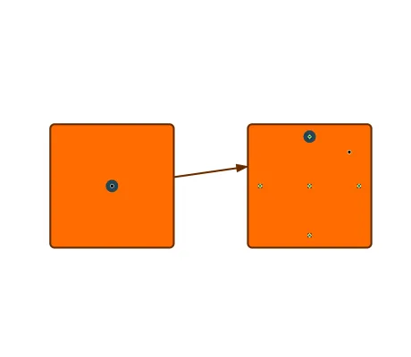

<!--
 //////////////////////////////////////////////////////////////////////////////
 // @license
 // This file is part of yFiles for HTML.
 // Use is subject to license terms.
 //
 // Copyright (c) 2026 by yWorks GmbH, Vor dem Kreuzberg 28,
 // 72070 Tuebingen, Germany. All rights reserved.
 //
 //////////////////////////////////////////////////////////////////////////////
-->
# Custom Port Location Model Demo - yFiles for HTML

[You can also run this demo online](https://www.yfiles.com/demos/input/customportmodel/).

This demo demonstrates how to create and use a custom [IPortLocationModel](https://docs.yworks.com/yfileshtml/api/IPortLocationModel).

## Things to Try

- Create a new node by clicking on the canvas and connect it to another node with a new edge. The green dots visualize the possible port candidates, which have been customized in this demo. The port location model defines five discreet locations for each node.
- Select one of the nodes and drag one of the port handles. You will only be able to move the handle to one of the other custom port locations supported by the port location model.
- Save and load the graph.
