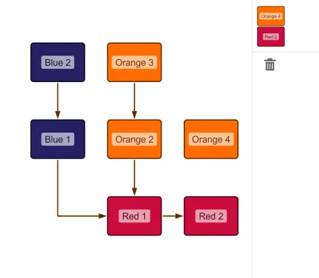

<!--
 //////////////////////////////////////////////////////////////////////////////
 // @license
 // This file is part of yFiles for HTML.
 // Use is subject to license terms.
 //
 // Copyright (c) 2026 by yWorks GmbH, Vor dem Kreuzberg 28,
 // 72070 Tuebingen, Germany. All rights reserved.
 //
 //////////////////////////////////////////////////////////////////////////////
-->
# Drag From Component Demo - yFiles for HTML

[You can also run this demo online](https://www.yfiles.com/demos/input/drag-from-component/).

This demo shows how to use the HTML Drag and Drop support to drag graph items from the component to other HTML elements.

## Things to Try

- Drag a node from the component to the element at the top right ("Drop Here").
- Drag a node from the component to the trashcan symbol to remove it from the graph.
- Edit the graph as usual. Note:
  - Dragging a node will let you drag it from the component.
  - Dragging a selected node while pressing Shift key will move the node on the component.
  - Dragging from a green port candidate with Shift held down will start edge creation.
