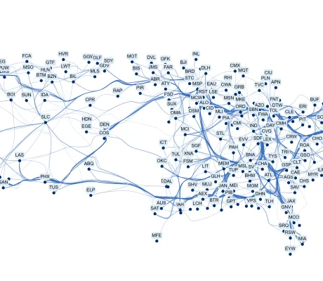

<!--
 //////////////////////////////////////////////////////////////////////////////
 // @license
 // This file is part of yFiles for HTML.
 // Use is subject to license terms.
 //
 // Copyright (c) 2026 by yWorks GmbH, Vor dem Kreuzberg 28,
 // 72070 Tuebingen, Germany. All rights reserved.
 //
 //////////////////////////////////////////////////////////////////////////////
-->
# Bundled Edge Router Demo - yFiles for HTML

[You can also run this demo online](https://www.yfiles.com/demos/layout-features/bundled-edge-router/).

This demo shows common configuration options for the [BundledEdgeRouter](https://docs.yworks.com/yfileshtml/api/BundledEdgeRouter) algorithm.

Edge bundling merges the common parts of multiple edges to increase the readability of dense graph drawings.

This demo highlights the configuration of the routing strategy, including:

- [Spanner](https://docs.yworks.com/yfileshtml/api/BundledEdgeRouterStrategy#SPANNER): A fast edge-path bundling approach that routes edges along the paths of a sparse auxiliary graph to create structured bundles with less visual ambiguity.
- [Voronoi](https://docs.yworks.com/yfileshtml/api/BundledEdgeRouterStrategy#VORONOI): An edge bundling approach that routes edges along paths in a graph constructed from the Voronoi regions of the nodes and, thus, reduces node–edge intersections.

The demo also applies the [GenericLabeling](https://docs.yworks.com/yfileshtml/api/GenericLabeling) algorithm to place the node labels.

## Demos

- [Edge Bundling Demo](../../layout/edgebundling/)
- [Bundled Edge Router Demo](../../layout-features/bundled-edge-router/)

## Documentation

- [Edge Bundling](https://docs.yworks.com/yfileshtml/dguide/layout-edge_bundling)
- [BundledEdgeRouter](https://docs.yworks.com/yfileshtml/api/BundledEdgeRouter)
- [BundledEdgeRouterData](https://docs.yworks.com/yfileshtml/api/BundledEdgeRouterData)
- [GenericLabeling](https://docs.yworks.com/yfileshtml/api/GenericLabeling)
