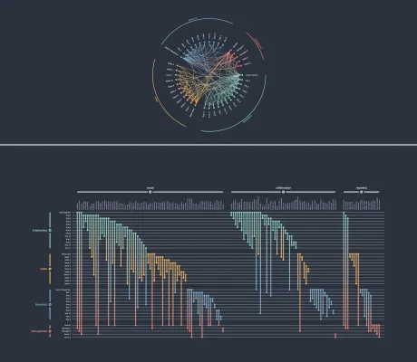

<!--
 //////////////////////////////////////////////////////////////////////////////
 // @license
 // This file is part of yFiles for HTML.
 // Use is subject to license terms.
 //
 // Copyright (c) 2026 by yWorks GmbH, Vor dem Kreuzberg 28,
 // 72070 Tuebingen, Germany. All rights reserved.
 //
 //////////////////////////////////////////////////////////////////////////////
-->
# Biofabrics Demo - yFiles for HTML

[You can also run this demo online](https://www.yfiles.com/demos/layout/biofabrics/).

A simple demonstration of and introduction to biofabric visualizations. A biofabric visualization of some graph, G \= ( V , E ) , represents each node v ∈ V as a row and each edge e ∈ E as a column. An edge is visually represented as a vertical line connecting the horizontal lines of its source and target nodes.

The simple (complete) example graph below consists of three nodes, i.e., A , B , C , and three edges, i.e., { A , B } , { A , C } , { B , C } .

## Things to Try

- **Highlight nodes**: mouse over a node's horizontal line to highlight its incident edges and adjacent nodes
- **Highlight edges**: mouse over an edge's vertical line to highlight its incident nodes
- **Highlight groups**: mouse over an edge/node group's text label to highlight its edge/node members
- **Focus+Context**: (Un)Collapse a node or edge group by clicking on its text label
- **Edge Color Modes**: Change the edge coloring, i.e., what aspects of the data dictate the color of edges
- **Edge/Node Sorting Modes**: Change the ordering of nodes and, in the case of the biofabric, also edges
- **Node/Edge Grouping**: Enable/disable edge/node groupings and change the ways in which they are sorted

## Data Description

## Known Issues in Safari

The gradient edge-style is currently not visible in Safari. We kindly request you use another browser, such as Google Chrome or Mozilla Firefox.
