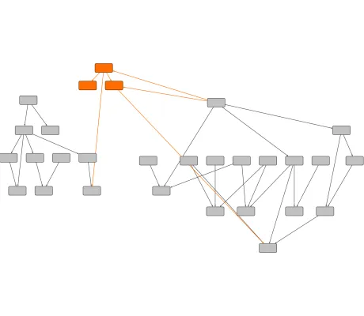

<!--
 //////////////////////////////////////////////////////////////////////////////
 // @license
 // This file is part of yFiles for HTML.
 // Use is subject to license terms.
 //
 // Copyright (c) 2026 by yWorks GmbH, Vor dem Kreuzberg 28,
 // 72070 Tuebingen, Germany. All rights reserved.
 //
 //////////////////////////////////////////////////////////////////////////////
-->
# Hierarchical Layout with Exact Coordinates Demo - yFiles for HTML

[You can also run this demo online](https://www.yfiles.com/demos/layout/hierarchical-exact-coordinates/).

This demo shows how to run the [HierarchicalLayout](https://docs.yworks.com/yfileshtml/api/HierarchicalLayout) such that a predefined subset of elements (called _incremental_ elements) is integrated into an existing drawing. The existing elements (called _fixed_ elements) should keep their current coordinates as much as possible.

Note that unlike for the [PartialLayout](https://docs.yworks.com/yfileshtml/api/PartialLayout) it is not guaranteed that the fixed elements keep their exact coordinates. However, if the underlying drawing was already produced by a run of the hierarchical layout, the resulting quality is almost always much better compared to a partial layout run.

## Things to Try

The demo allows for specifying fixed and incremental elements. _Fixed_ elements are drawn _grey_ and _incremental_ elements are _colored_.

- To change the fixed/incremental state of elements, select the corresponding elements and click on the _Lock Selected Elements_ or _Unlock Selected Elements_ button.The current state of the selected elements can be toggled with a double-click.
- To start the hierarchical layout click on the play button.

The required setup to create such drawings is easy and straightforward: the algorithm has to be set to incremental layout mode by setting the [from sketch mode property](https://docs.yworks.com/yfileshtml/api/HierarchicalLayout#fromSketchMode) to `true`. In addition, to specify fixed and incremental elements, the [HierarchicalLayoutData](https://docs.yworks.com/yfileshtml/api/HierarchicalLayoutData) class offers the [incremental node hints property](https://docs.yworks.com/yfileshtml/api/HierarchicalLayoutData#incrementalNodeHints).
