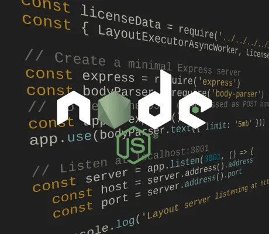

<!--
 //////////////////////////////////////////////////////////////////////////////
 // @license
 // This file is part of yFiles for HTML.
 // Use is subject to license terms.
 //
 // Copyright (c) 2026 by yWorks GmbH, Vor dem Kreuzberg 28,
 // 72070 Tuebingen, Germany. All rights reserved.
 //
 //////////////////////////////////////////////////////////////////////////////
-->
# Node.js Demo – yFiles for HTML



[You can also run this demo online](https://www.yfiles.com/demos/loading/nodejs/).

This demo shows how to run a yFiles layout algorithm in _[Node.js](https://nodejs.org/)_. This makes it possible to run the layout calculation asynchronously, preventing it from blocking the UI.

To transfer the graph structure and layout between the _Node.js_ _[Express](https://expressjs.com/)_ server and the main page, the [LayoutExecutorAsync](https://docs.yworks.com/yfileshtml/api/LayoutExecutorAsync) creates a serializable data object on the client-side and sends it to the _Node.js_ server.

On the server-side, the [LayoutExecutorAsyncWorker](https://docs.yworks.com/yfileshtml/api/LayoutExecutorAsyncWorker) parses this data object and provides a callback which allows to apply a layout on the parsed graph. This callback is executed by calling `process(data)` on the worker which resolves with a serializable result data object that is supposed to be sent back to the [LayoutExecutorAsync](https://docs.yworks.com/yfileshtml/api/LayoutExecutorAsync).

On the client-side, the [LayoutExecutorAsync](https://docs.yworks.com/yfileshtml/api/LayoutExecutorAsync) waits for the response of the [LayoutExecutorAsyncWorker](https://docs.yworks.com/yfileshtml/api/LayoutExecutorAsyncWorker) and eventually applies the result to the graph.

## Things to Try

Modify the graph structure by adding/removing nodes and edges, and re-run the _Node.js_ layout.

## Note on licensing

Running yFiles for HTML on a Node.js server requires a license that explicitly allows this. Please contact the [sales team](mailto:sales@yworks.com) for more information.

## Running the Node.js Layout Server

1.  Navigate to the `layout-server` subdirectory of this demo's directory
2.  Install the required node modules:

    ```
    \> npm install
    ```

3.  Run the layout server:

    ```
    \> npm start
    ```
