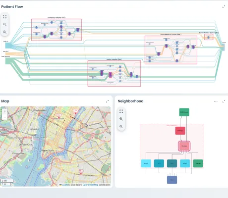

<!--
 //////////////////////////////////////////////////////////////////////////////
 // @license
 // This file is part of yFiles for HTML.
 // Use is subject to license terms.
 //
 // Copyright (c) 2026 by yWorks GmbH, Vor dem Kreuzberg 28,
 // 72070 Tuebingen, Germany. All rights reserved.
 //
 //////////////////////////////////////////////////////////////////////////////
-->
# Dashboard Demo – yFiles for HTML

[You can also run this demo online](https://www.yfiles.com/demos/showcase/dashboard/).

This dashboard lets you explore the same data set through different lenses, highlighting graph structure, location, time or other attributes. Interaction with the data in one view will trigger an update in the other views to keep them in sync. Use the maximize button to expand a view.

## Healthcare capacity

Monitor capacity utilization across three hospitals and one rehabilitation center. The graph and gauges show current load, while the timeline surfaces admissions and discharges, the map locates each facility, and bed-capacity pie charts summarize availability. Select a facility to view its properties and relationships, use filters to compare facilities by type, and discover connections in the neighborhood view.

## Electricity network

Track how the load in an European electricity network evolves over the course of one day. The graph depicts producers, consumers, and interconnections including a heatmap to show load intensity. The timeline lets you step through the day and jump to key events. The map visualizes the entities' geo-locations across countries. Filter by asset type or country, inspect properties and neighborhoods, and use the pie charts to explore the power mix.
