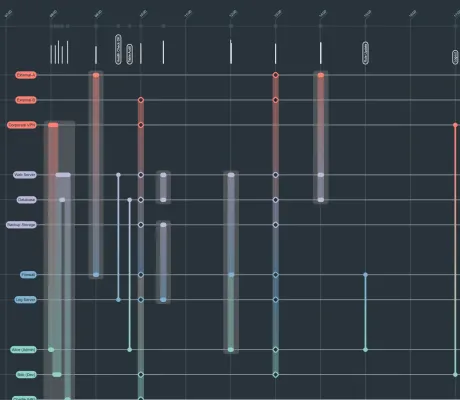

<!--
 //////////////////////////////////////////////////////////////////////////////
 // @license
 // This file is part of yFiles for HTML.
 // Use is subject to license terms.
 //
 // Copyright (c) 2026 by yWorks GmbH, Vor dem Kreuzberg 28,
 // 72070 Tuebingen, Germany. All rights reserved.
 //
 //////////////////////////////////////////////////////////////////////////////
-->
# Event Timeline Demo - yFiles for HTML

[You can also run this demo online](https://www.yfiles.com/demos/showcase/event-timeline/).

An event timeline is a tabular representation of a dynamic, i.e., time-dependent, graph: each node (entity) is represented as a (labeled) parallel horizontal line-segment spanning the width of the canvas; each edge (event), is visualized as a (labeled) parallel vertical line segment connecting its source and target nodes' line-segments.

Event timelines determine their edges' x-coordinates as a function of their timestamp, i.e., when exactly the event described by the edge takes place. This means that edges that are closer to one another (in x-space) occur closer in time to each other, whereas edges further apart from one another occur further in time from one another.

## Interactivity

- **Edge hover:** Visualize edge details in tooltip, highlight the edge and its incident nodes, and highlight its timestamp in the timeline
- **Node hover:** Visualize node details in tooltip, highlight the node + its incident edges + its adjacent nodes, and highlight the timestamps of the node's first and last incident edge.
- **Timeline hover:** Highlight all edges at an articular point in time as well as their incident nodes.
- **Scroll wheel:** zoom horizontally
- **Ctrl + Scroll Wheel:** zoom vertically
- **Left-click + drag the canvas:** pan up/down and left/right
- **Right-click + drag the canvas:** select a region to zoom into
- **Left-click + drag the timeline:** select a region to zoom into

## Things to Try

- **Explore:** This interactive event timeline visualization offers users the ability to explore their data. Zoom out to gain an overview of the data. Zoom in inspect a particular region in more detail. Pan left and right to understand the evolution of the graph in time.
- **Aggregate:** As you zoom out (along the visualization's x-axis) edges will get closer and closer to one another, resulting in edge clutter and thus a poorly readable visualization. To curb the negative impact hereof, edges are aggregated once they are close enough to one another (and they form a connected component).
- **Inspect:** Some edges might occur at exactly the same point in time. This means that no matter how much one zooms in, these edges will always lie atop one another. We have opted to render such edges as a so-called hyperedge. Clicking on one of these hyperedges will provide you with a detailed view that particular timestamp.
- **Reduce:** Nodes can fall into different node groups, as indicated by their color. Sometimes, however, a particular node group might not be of particular interest to a user. Clicking on any node in such a node group will visually collapse said group. Clicking on this collapsed node group again will uncollapse it.

## Related Demos

- [Biofabrics Demo](../../layout/biofabrics/)
- [Timeline Demo](../../application-features/timeline/)
