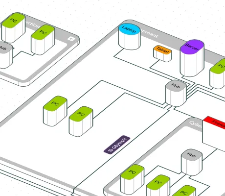

<!--
 //////////////////////////////////////////////////////////////////////////////
 // @license
 // This file is part of yFiles for HTML.
 // Use is subject to license terms.
 //
 // Copyright (c) 2026 by yWorks GmbH, Vor dem Kreuzberg 28,
 // 72070 Tuebingen, Germany. All rights reserved.
 //
 //////////////////////////////////////////////////////////////////////////////
-->
# Isometric Drawing Demo – yFiles for HTML

[You can also run this demo online](https://www.yfiles.com/demos/showcase/isometricdrawing/).

Demo

This demo uses advanced features of yFiles to render complex SVG node and edge styles in a [projected](https://docs.yworks.com/yfileshtml/dguide/projections-main) perspective, adding a third dimension.

This view uses a compact isometric projection with simple node styles and a dedicated z-order comparator, making the implementation easy to study and reuse.

## Interaction

The visualization features the full range of interactions [supported by yFiles](https://docs.yworks.com/yfileshtml/dguide/interaction-support). In addition, each node has a special handle at its top to change the height of the node.

A custom InputMode is used that allows controlling the rotation and inclination of the scene.

The isometric view uses a fixed projection inclination; use the rotation slider to change its viewing direction.

## Things to Try

- Use the right mouse button to orbit the scene and the middle mouse button to move it.
- Change the rotation or inclination of the scene with the sliders in the toolbar.
- Change the height of a node by selecting it and dragging the handle at its top.
- Create new nodes by clicking on empty space in the canvas, or change groupings with ctrl + g

- Change the viewing direction with the rotation slider in the toolbar.
- Change the height of a node by selecting it and dragging the handle at its top.
- Create new nodes by clicking on empty space in the canvas, or change groupings with ctrl + g

## Layout

There are two layout algorithms to apply to the graph:

- Hierarchical layout
- Orthogonal layout

## Loading Graphs

Load your own graph and display it in the selected view. Note that the active view's default styles are applied to the nodes in your GraphML.
