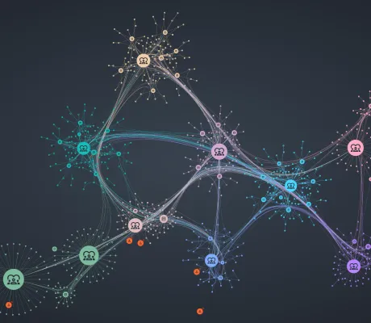

<!--
 //////////////////////////////////////////////////////////////////////////////
 // @license
 // This file is part of yFiles for HTML.
 // Use is subject to license terms.
 //
 // Copyright (c) 2026 by yWorks GmbH, Vor dem Kreuzberg 28,
 // 72070 Tuebingen, Germany. All rights reserved.
 //
 //////////////////////////////////////////////////////////////////////////////
-->
# Interactive Knowledge Graph Demo – yFiles for HTML

[You can also run this demo online](https://www.yfiles.com/demos/showcase/knowledge-graphs/).

Demo

This demo visualizes a knowledge graph and highlights potential data quality issues, providing interactive tools to inspect and resolve them.

Knowledge graphs are typically represented as triples (subject–predicate–object). Since triples often come from diverse sources and formats, common issues include duplicate nodes, edges connected to incorrect endpoints, and isolated nodes.

The visualization clusters nodes using the [Louvain Modularity](https://docs.yworks.com/yfileshtml/api/LouvainModularityClustering) algorithm, with node colors indicating their cluster membership. Node size reflects centrality, calculated with the [PageRank](https://docs.yworks.com/yfileshtml/api/PageRank) algorithm.

## Things to Try

Use the 'Walkthrough' at the top of the left sidebar to learn the demo basics and get familiar with its features.

### Interactive Ontology View

The **Interactive Ontology View** displays all triples in the dataset. Use it to filter or fade out graph elements based on selected triples or to hide specific types from the main graph.

- Click an edge to highlight items matching its triplet (subject, predicate, object) - WebGL browsers only.
- Click an edge to filter the graph to show only items matching its triplet.
- Click a node or edge to show or hide its type.
- Press reset\_settings to reset all filters and highlights.

### Problem Detection

Click 'Click here to see details' to view detected issues. For each issue, you can zoom to the affected node(s) or apply automatic fixes. Problems can also be fixed by right-clicking the element and using its context menu.

- Enable 'Spotlight all issues' to highlight all problematic elements with a beacon animation (WebGL browsers only).
- Merge duplicate nodes (copy\_all) to consolidate identical entities.
- Remove isolated nodes (error) that have no connections to the rest of the graph.
- Fix edges with incorrect endpoints (warning) by selecting the edge and reconnecting it to the correct nodes.

### Main Graph

- Double-click a node to open the neighborhood view, displaying all nodes directly connected to it.
- Change the layout using the **'Group By'** dropdown.

### Interactive Neighborhood View

- Click a node in this view to show its neighbors. The main graph will zoom to the selected node.
