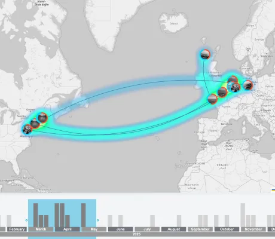

<!--
 //////////////////////////////////////////////////////////////////////////////
 // @license
 // This file is part of yFiles for HTML.
 // Use is subject to license terms.
 //
 // Copyright (c) 2026 by yWorks GmbH, Vor dem Kreuzberg 28,
 // 72070 Tuebingen, Germany. All rights reserved.
 //
 //////////////////////////////////////////////////////////////////////////////
-->
# Space & Time Demo - yFiles for HTML

[You can also run this demo online](https://www.yfiles.com/demos/showcase/time-space/).

This interactive demo visualizes the spread of contaminants across different locations over time. It allows you to trace how a single incident - a train derailment - can lead to a widespread contamination event.

Each circle on the map represents a specific event, connecting to relevant events in the past and future. The heatmap overlay on the map visualizes the concentration of the contamination, hotter colors signifying higher severity.

This demo is designed for the use case [Navigating Your Graph Through Time and Space](https://www.yfiles.com/solutions/use-cases/graph-navigation-space-time). Other example use cases include anti-terrorism, fraud detection, research collaboration networks, historical data, etc.

## Things to Try

public Geospatial View

- **Hover** over an event or connection to see an overview.
- **Click** an event to view its full details in the side panel.
- Use the **timeline** at the bottom to explore more events according to their time of occurrence.

hub Centric View

- Switch to the Centric View to focus on a single event and its neighboring events in the past and future.
- **Double-click** an event to bring it to the center.

account_tree Tree View

- Switch to the Tree View to see the chain of events in a tree layout, making it easy to trace the contamination from its source.
