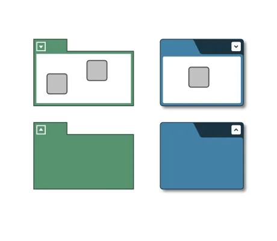

<!--
 //////////////////////////////////////////////////////////////////////////////
 // @license
 // This file is part of yFiles for HTML.
 // Use is subject to license terms.
 //
 // Copyright (c) 2026 by yWorks GmbH, Vor dem Kreuzberg 28,
 // 72070 Tuebingen, Germany. All rights reserved.
 //
 //////////////////////////////////////////////////////////////////////////////
-->
# Group Node Style Demo - yFiles for HTML

[You can also run this demo online](https://www.yfiles.com/demos/style/group-node-style/).

[GroupNodeStyle](https://docs.yworks.com/yfileshtml/api/GroupNodeStyle) is a style primarily intended for groups and folders, i.e., collapsed groups.

This style offers many configuration options for customizing its look. Please see chapter [GroupNodeStyle](https://docs.yworks.com/yfileshtml/dguide/styles-node_styles#styles-GroupNodeStyle) in the Developer's Guide and the [GroupNodeStyle](https://docs.yworks.com/yfileshtml/api/GroupNodeStyle) API documentation for more detailed information.

The related [GroupNodeLabelModel](https://docs.yworks.com/yfileshtml/api/GroupNodeLabelModel) places node labels inside the tab or the background area next to the tab of a group or folder when used together with `GroupNodeStyle`.

## Things to try

- Click the expansion state icons

  minus

  add_2

  keyboard_arrow_down

  keyboard_arrow_up

  arrow_drop_down

  arrow_drop_up

  to collapse groups or expand folders.

- Double-click a group or a folder. This will collapse a group and expand a folder even if there is no expansion state icon.
- When using SVG rendering, move the mouse over one of the expansion state icons. The icon will slightly increase in size in response to the mouse hovering over it.  
  This CSS transition effect is specified in the demo's local <style> definition.
- When using SVG rendering, collapse a group or expand a folder with a chevron or triangle icon. The expansion state icon will change in an animated fashion in response to the state change.  
  This CSS transition effect is specified in the demo's local <style> definition.
- Hover over a group node to get a tool tip that lists the configured properties for each group style.
