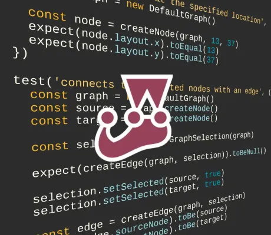

<!--
 //////////////////////////////////////////////////////////////////////////////
 // @license
 // This file is part of yFiles for HTML.
 // Use is subject to license terms.
 //
 // Copyright (c) 2026 by yWorks GmbH, Vor dem Kreuzberg 28,
 // 72070 Tuebingen, Germany. All rights reserved.
 //
 //////////////////////////////////////////////////////////////////////////////
-->
# Jest Demo – yFiles for HTML

This shows how to use [Jest](https://jestjs.io/) for unit testing yFiles for HTML application logic.

If you want to test your yFiles application with Jest in a fully functional browser environment, see the [Jest Puppeteer Demo](../jest-puppeteer/README.html).

You can find more information about [testing a yFiles-based application](../../README.html) in general, and about using [Jest and yFiles](https://docs.yworks.com/yfileshtml/dguide/testing/#testing-jest) together in particular, in the documentation.

### Running the unit tests

1.  Go to the demo's directory `demos-ts/testing/jest`.
2.  Run `npm install`.
3.  Run the unit tests with `npm run test`.
