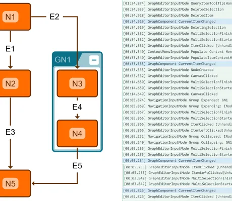

<!--
 //////////////////////////////////////////////////////////////////////////////
 // @license
 // This file is part of yFiles for HTML.
 // Use is subject to license terms.
 //
 // Copyright (c) 2026 by yWorks GmbH, Vor dem Kreuzberg 28,
 // 72070 Tuebingen, Germany. All rights reserved.
 //
 //////////////////////////////////////////////////////////////////////////////
-->
# Events Viewer Demo - yFiles for HTML

[You can also run this demo online](https://www.yfiles.com/demos/view/events/).

This demo shows the multitude of events provided by the classes [IGraph](https://docs.yworks.com/yfileshtml/api/IGraph) and [GraphComponent](https://docs.yworks.com/yfileshtml/api/GraphComponent) and the _Input Modes_. Feel free to switch event logging on and off for the kinds of events below, while interacting with the graph and its elements. You might want to try toggling the input mode using the "Edit Mode" checkbox.

Generally, when looking for an event that fits your needs, you should start looking at the top of the list and work your way down. In most cases, it is preferable to use input mode events instead of subscribing to the low-level graph events, which should be reserved for rare cases where the layers above won't suffice.

## Event Types

### Input Mode Events keyboard_arrow_down

- Viewer/Editor Events
- Navigation Events
- Click Events
- Move Events
- Move Viewport Events
- Handle Move Events
- Item Hover Events
- Edit Label Events
- Text Editor Events
- Context Menu Events
- Create Bend Events
- Create Edge Events
- Drag and Drop Events

### GraphComponent Events keyboard_arrow_right

- Clipboard Events
- Pointer Events
- Key Events
- Selection Events
- Viewport Events
- Render Events
- Other Events

### Graph Events keyboard_arrow_right

- Node Events
- Edge Events
- Label Events
- Port Events
- Bend Events
- Hierarchy Events
- Folding Events
- Graph Render Events
- Undo Events
