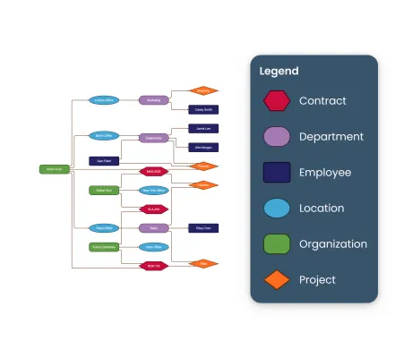

<!--
 //////////////////////////////////////////////////////////////////////////////
 // @license
 // This file is part of yFiles for HTML.
 // Use is subject to license terms.
 //
 // Copyright (c) 2026 by yWorks GmbH, Vor dem Kreuzberg 28,
 // 72070 Tuebingen, Germany. All rights reserved.
 //
 //////////////////////////////////////////////////////////////////////////////
-->
# Legend Demo – yFiles for HTML

[You can also run this demo online](https://www.yfiles.com/demos/view/legend/).

Demo

This demo shows different ways to visualize a legend. The graph contains different types of nodes, each represented with a distinct style. The legend explains what each node type represents.

## Legend Types

HTML Panel

Simple HTML elements floating above the graph component. This is the easiest way to display a legend.

Render Tree

Moves and scales with the graph. Useful if the legend should be exported/printed together with the graph. Considered when fitting the graph.

Render Tree (fixed-size)

Also part of the render tree but fixed in size and location.

Graph Component

A separate graph component floating above the main graph component.

## Things to Try

- Switch between legend types.
- Hover items of the HTML panel legend to highlight all instances in the graph.
- Drag around the render tree legends.
- Collapse and expand the graph component legend.
- Toggle _Show legend_ to show or hide the legend.
- Change the legend orientation: If _Horizontal_ is checked, the legend entries are shown in a row at the bottom. Otherwise, they appear as a column on the right.
- Toggle _Only types in viewport_: When enabled, only node types currently visible in the viewport are displayed in the legend. The legends update automatically as the viewport changes.
