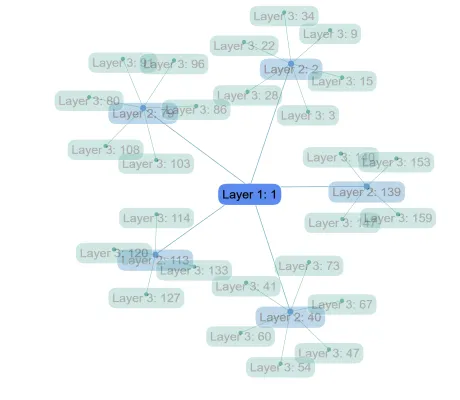

<!--
 //////////////////////////////////////////////////////////////////////////////
 // @license
 // This file is part of yFiles for HTML.
 // Use is subject to license terms.
 //
 // Copyright (c) 2026 by yWorks GmbH, Vor dem Kreuzberg 28,
 // 72070 Tuebingen, Germany. All rights reserved.
 //
 //////////////////////////////////////////////////////////////////////////////
-->
# WebGL Label Fading Demo - yFiles for HTML

[You can also run this demo online](https://www.yfiles.com/demos/view/webgl-label-fading/).

This demo shows how to achieve a simple _level of detail (LOD)_ display in [WebGL](https://docs.yworks.com/yfileshtml/dguide/webgl2) rendering by fading out labels, nodes, and edges at certain zoom levels.

## Things to try

- Zoom into the graph and observe as labels are faded in, along with additional layers in the tree.
- Note that labels also do not visually scale at certain zoom levels so that they are more legible.
- Opposed to nodes and edges, labels will hide again when zoomed in too close.

See the sources for details.
